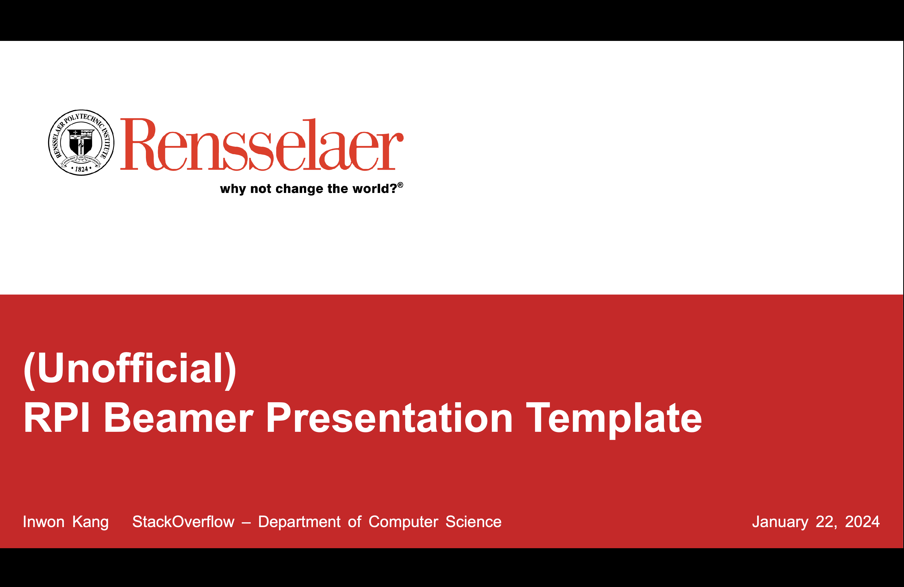
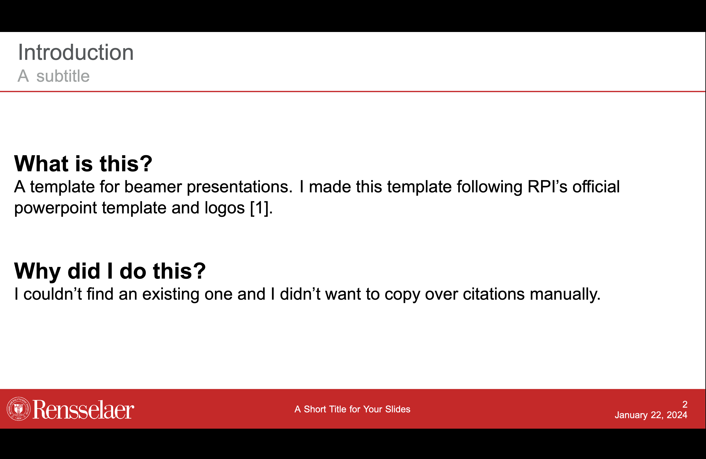
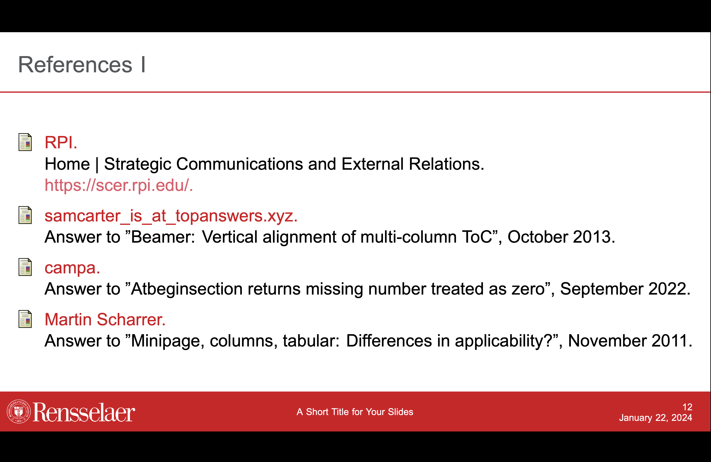
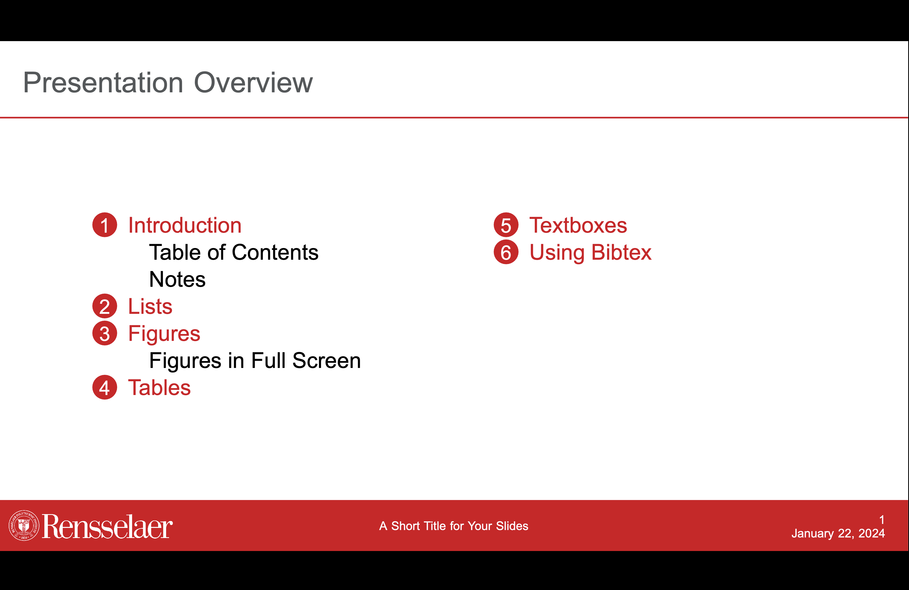
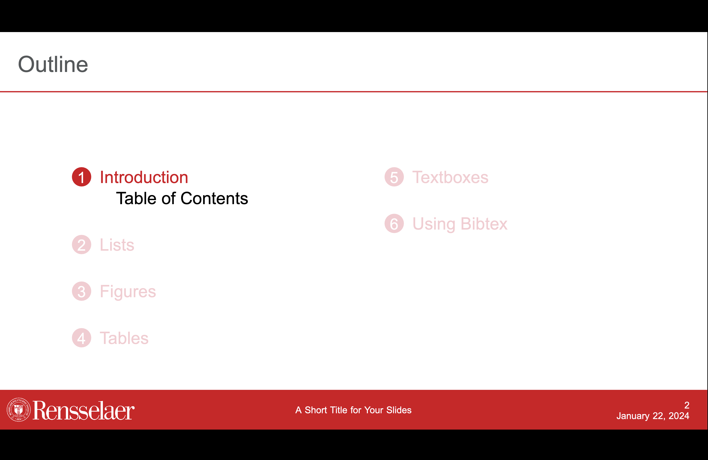

# Unofficial Beamer Presentation Template for RPI

Refer to `main.tex` for example usage.
Please feel free to suggest any changes (even better) implement your own.

# Screenshots

## Title Page

## Regular Page

## Textblocks

## Citations

## Table of Contents

## Section Overview

