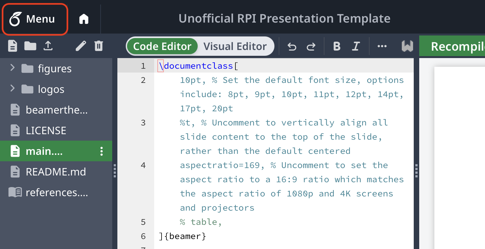
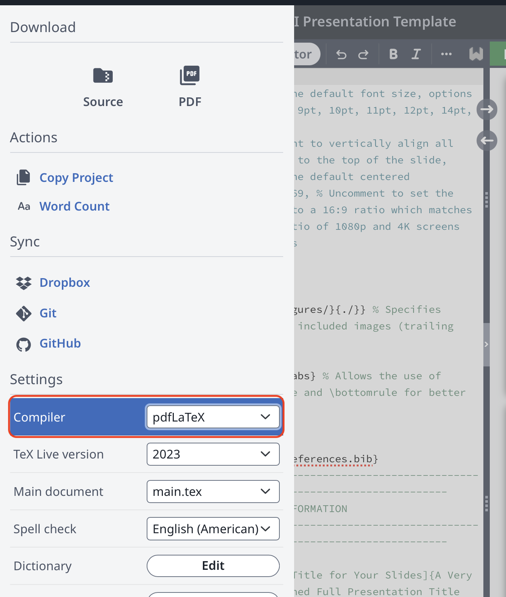

# Unofficial Beamer Presentation Template for RPI

Refer to `main.tex` for example usage.
Please feel free to suggest any changes (even better) implement your own.

## Usage

Copy the `beamerthemeRPI.sty` file to the directory of your `.tex` file.
Also copy the `logos` to the same directory (that the `tex` file lives in).
This is required for because the logos need to be rendered at the footer of each slide.

You also need to use `lualatex` compiler instead of `pdflatex` because of the font. (Arial doesn't work on pdflatex?)

If you are on overleaf, you can do this:

First open the menu

And then select either `LuaLaTeX` or `XeLaTeX` as the compiler.

[Preview the template here](./main.pdf)
