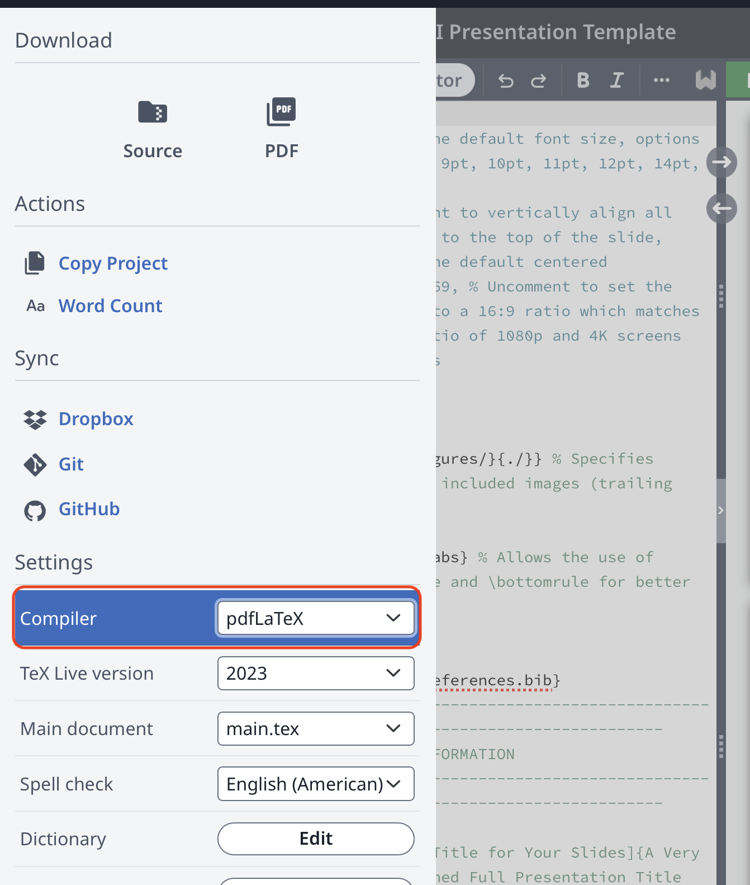
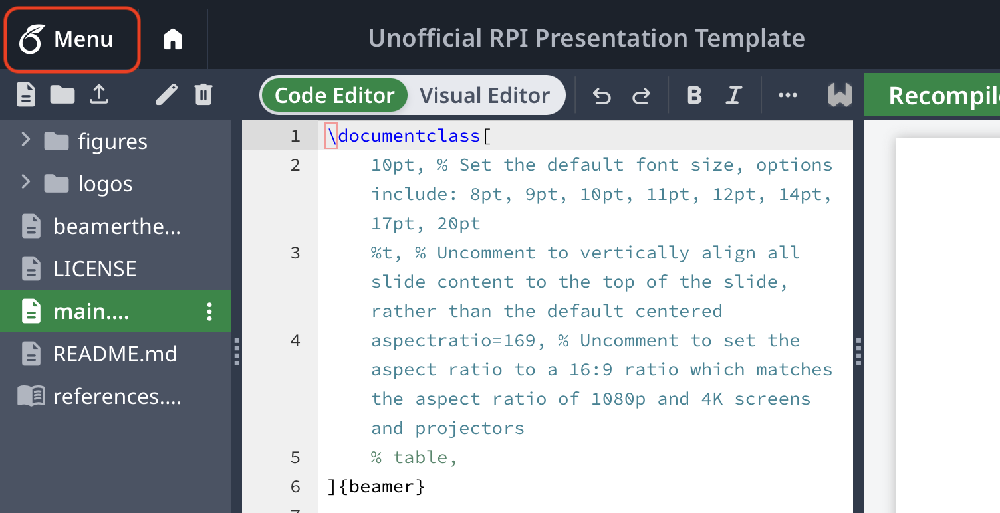

# Unofficial Beamer Presentation Template for RPI

Refer to `main.tex` for example usage.
Please feel free to suggest any changes (even better) implement your own.

[Preview the template here](./main.pdf)

---

## Setting up

- You need the `beamerthemerpi.sty` file and `logos` and `fonts` directory to use this template.
  - The logos and fonts can also be directly downloaded from [the RPI brand website](https://brand.rpi.edu). For the fonts, just download the desktop variant (`*.otf` files).
- You also need to use `lualatex` compiler instead of `pdflatex` because of the font. (Arial doesn't work on pdflatex?)

**Local**

1. Clone the repository.

   ```bash
   git clone https://github.com/inwonakng/unofficial-rpi-presentation-template
   ```

2. Set xelatex or lualatex as the default compiler for latexmk.
   - I use the following `.latexmkrc` file to change the compiler to `xelatex` (latexmk to compile my documents locally.). You can also keep one in `~/.latexmkrc` to make it global (local will override global).
   - The logos are also from the website, but I converted them to PDF for convenience (there's probably ways to use SVG in latex, but I don't want to deal with that).
   - The bar is *not* directly from the brand website. I had to rip it out of the pptx template file because the SVG they provide is too short and it is not nicely designed to extend.

   ```latexmkrc
   # $pdf_mode = 4; # sets lualatex to default engine.
   $pdf_mode = 5; # sets xelatex to default engine.
   $dvi_mode = 0;
   ```

3. Copy over the `fonts` and `logos` directories to the root of your latex project.

**Overleaf**

- Start by cloning [this project](https://www.overleaf.com/read/yshxrvnkbdjz#48311c). (we can't upload unofficial templates to overleaf anymore).
- double check the compiler checking this option in the menu:
  
  .
  - if not already selected, select either `LuaLaTeX` or `XeLaTeX` as the compiler.
