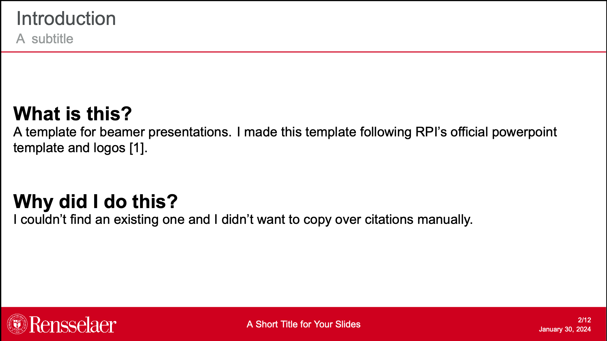
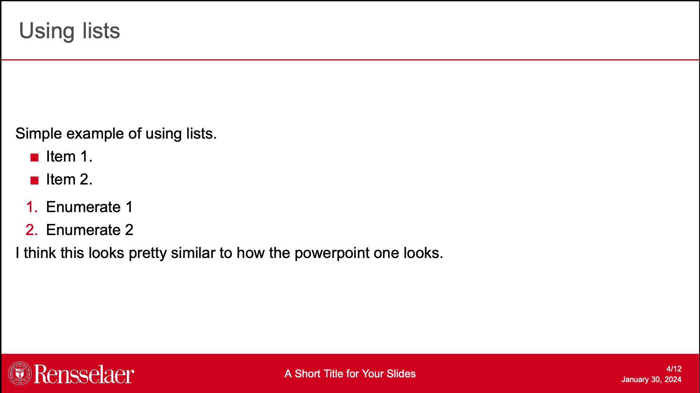
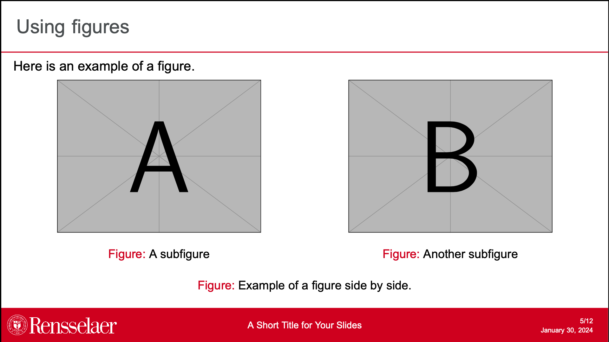
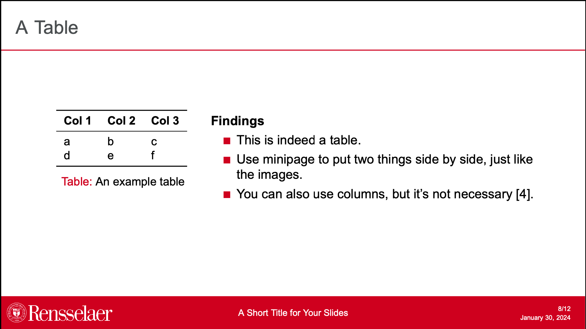
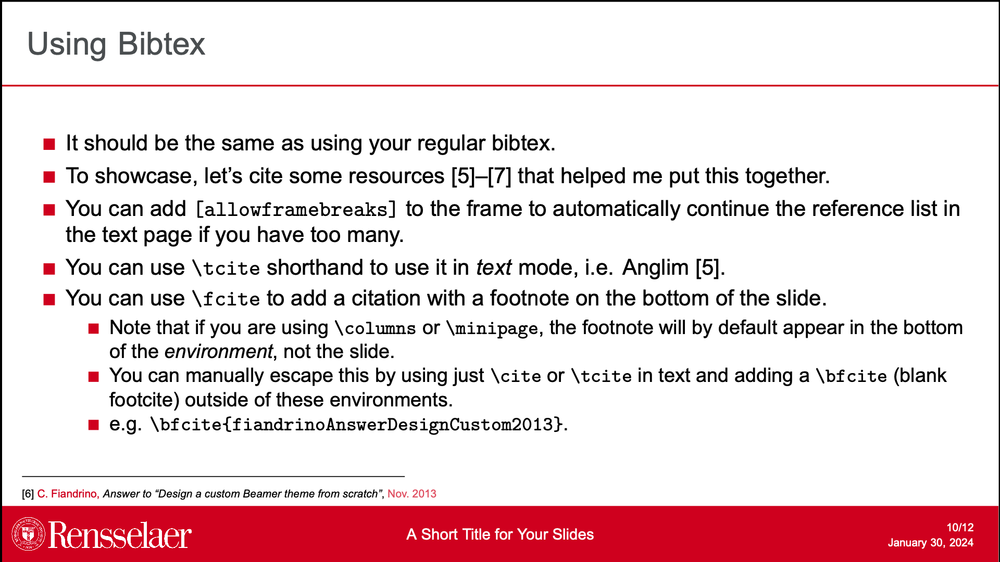
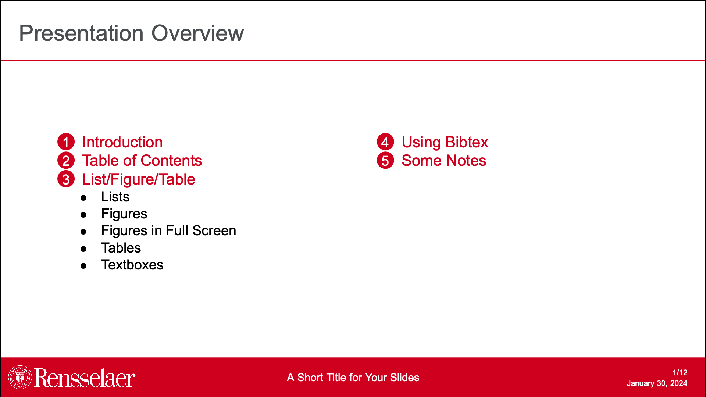
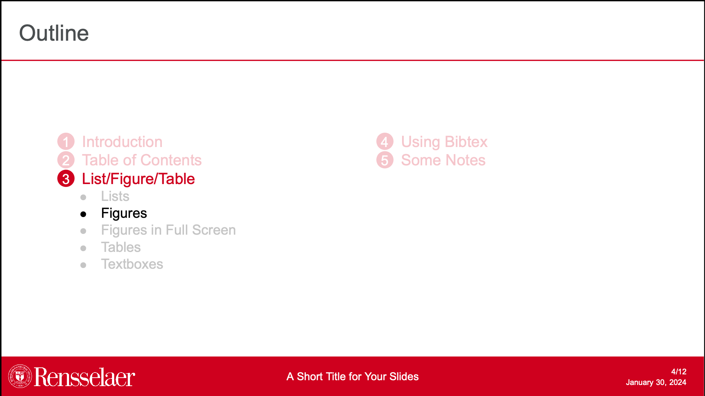
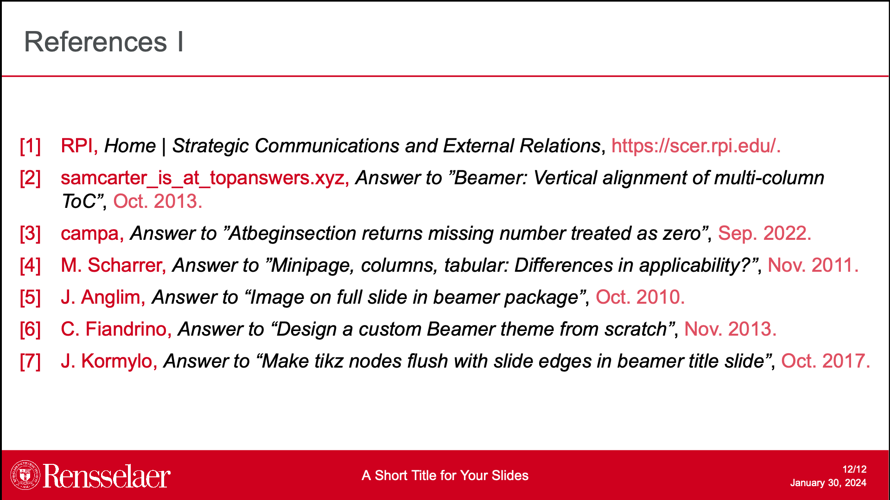

# Unofficial Beamer Presentation Template for RPI

Refer to `main.tex` for example usage.
Please feel free to suggest any changes (even better) implement your own.

# Screenshots

## Title Page

## Regular Page

## List

## Figure(s)

## Table(s)

## Textblocks

## Using bib

## Table of Contents

## Section Progress

## Citations

